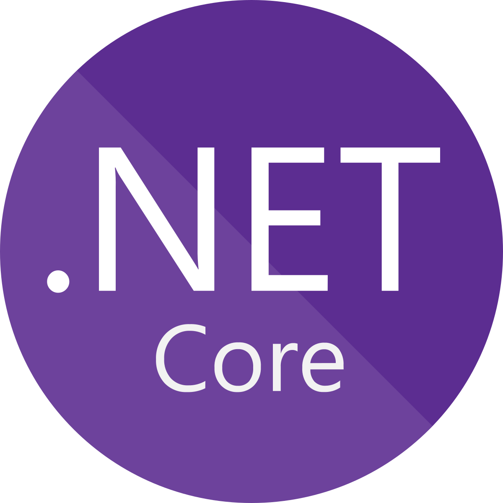

# Portfolio (ASP.NET Core)

## Description
This ASP.NET Core project acts as a lightweight portfolio website. Taking advantage of the Model-View-Controller (MVC) pattern allows for a structured and polished layout of relevant portfolio highlights with minimal adjustments required.
  

## Functionality
Allows for the entry of job positions, skills and education through a SQLite database. The "About Me" view presents entitites in a clear and concise format.

## Technologies
* ASP.NET Core
* Razor Pages
* MongoDB
* Mongoose
* bcrypt
* Multer

## Languages
C#
SQLite
HTML
CSS